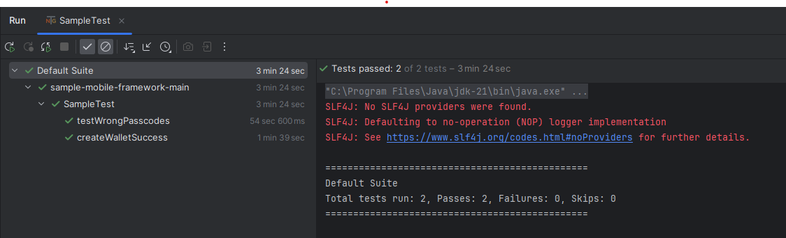

# Appium-Automation
Android automation testing with TDD framework using Appium, Java, TestNG & design pattern Page Object Model (POM) with Page Factory


## 1. POM
This automation framework is created using POM design pattern.

POM stands for Page Object Model. 
POM is a design pattern used to make automation. 
Here each page an application or website is used as its own class. 
This gives an advantage when one of a page's interface changes, then other classes will not be affected.


## 2. TDD
Test-driven development (TDD) is a software development method in which tests are written before the code. It validates that the code meets defined requirements, keeps the codebase correct and modular, and supports safe, incremental changes throughout development.

TestNG is used to trigger/handle the test case execution & Java is used as the programming language.


## 3. Appium
Appium is a popular open-source automation framework used for testing native, mobile web, and hybrid applications across different platforms like iOS and Android.


## 3. Pre-Requisites & Setup required

To Start Automation with Appium, we have to follow couple of steps.
First we have to make your system ready then we can start our journey with appium.

1. [Download & Install JDK](https://www.oracle.com/java/technologies/javase/jdk11-archive-downloads.html)
2. [Download & Install IntelliJ IDEA Community Version](https://www.jetbrains.com/idea/download/)
3. [Download & Install android studio Android SDK thourgh Android Studio](https://developer.android.com/studio)
4. [Download & Install LTS Node Js](https://nodejs.org/en/download/)
6. Set environment variable(path):  Set JAVA_HOME & ANDROID_HOME
7. Check if node.js, npm & Android SDK are installed: node --version, npm --version, adb --version
8. Install appium : Appium Version 2 commands installation process
9. Check if appium is installed: appium -v
10. Use the emulator device for execution
    - Run command 'adb devices' to check the emulator details.
11. To run using actual device - Plugin Device (turn on developer mode & USB debugging)
    - Find build number under settings and tap 7 times on build number.
    - Enter your pattern, PIN or password to enable the Developer options menu.
    - The "Developer options" menu will now appear in your Settings menu.
    - Turn On the "USB Debugging" option from "Developer Options"
12. Indentify appPackage & appActivityName
    Open the app in your device. and use the command: adb shell dumpsys window | grep -E 'mCurrentFocus'


## Appium Version 2 commands
1. Install Appium: npm i --location=global appium
2. Uninstall Appium: npm uninstall -g appium
3. check drivers list: appium driver list
4. Install uiautomator2 & execute-driver driver: appium driver install uiautomator2, appium plugin install execute-driver
5. check plugin list: appium plugin list
6. Install Plugin: appium plugin install plugin_name
7. Run with path: appium --base-path /wd/hub
8. Run Appium: appium
9. Run Appium with plugin & path: appium --use-plugins=execute-driver --base-path /wd/hub

### Related Resources
* [Appium NPM](https://www.npmjs.com/package/appium)
* [Appium GitHub](https://github.com/appium/appium)

##  Create Java(Gradle) Project in IntelliJ IDEA for Appium
1. Create Java(Gradle) Project in IntelliJ IDEA
2. Add Gradle Dependencies
    - [Selenium](https://mvnrepository.com/artifact/org.seleniumhq.selenium/selenium-java)
    - [Appium Client](https://mvnrepository.com/artifact/io.appium/java-client)
    - [TestNG](https://mvnrepository.com/artifact/org.testng/testng)
3. [Desired Capabilities](https://appium.io/docs/en/writing-running-appium/caps/)


## Appium Inspector to Identify Elements
1. [Appium Inspector download & install](https://github.com/appium/appium-inspector/releases)
2. **Configure  Appium Inspector**
- Appium Inspector
    -  Go to or Open Appium Inspector
        - Remote host: 127.0.0.1
        - Port: 4725
        - Path: /wd/hub

3. **Set DesiredCapabilities**
- capabilities.setCapability("platformName", "Android");
- capabilities.setCapability("appium:automationName", "UiAutomator2");
- capabilities.setCapability("appium:deviceName", "emulator-5554");


### Run appium server

`appium server -p 4725 -a 127.0.0.1 -pa /wd/hub`

### Check running task at port 4725

`netstat -ano | findstr :4725`

### Kill running task

`taskkill /pid <pid> /f`

### Project Structure

```
|-- main
		|-- java
				|-- pages
				    |-- BasePage
                |-- utils
				    |-- DriverUtils
				    |-- FunctionLibrary
				    
|-- test
		|-- java
				|-- tests
				    |-- BaseTest
				    |-- SampleTest
		|-- resources
				|-- app
          
```

- `BasePage` java file to store all page objects.
- `DriverUtils` java file to handling driver like initialization, getDriver, quitDriver, etc.
- `FunctionLibrary` java file for all generic methods to implement modularity & re-usability.
- `tests` package which contains BaseTest to handle hooks (pre-requisite & post-requisite). SampleTest contains the test cases to cover positive & negative case for Create Wallet.
- `app` directory to save apk file.


### **Key functionalities covered**
1. Create wallet successfully -> Positive test case, Providing correct details to create wallet & assert headers as well as objects in each screen. 
2. Passcode Not Matching -> Negative test case to check the error message when passcodes provided in create passcode & confirm passcode doesn't match.


### **Run Test Case**
1. **Run Test Cases** - Go to desired Java Class 'SampleTest'. Right click of mouse on the file & Select - Run 'SampleTest' option. It triggers all test cases.
2. **Run Test Cases** - Go to desired Java Class 'SampleTest'. Click on Run icon on the left of class to run all test cases. Clicking on Run icon to the left of test triggers only specific test case.
3. **Run XML File** - After create TestNG file, Right click of mouse on TestNG xml >> click on Run

### **Screenshot of test result**


